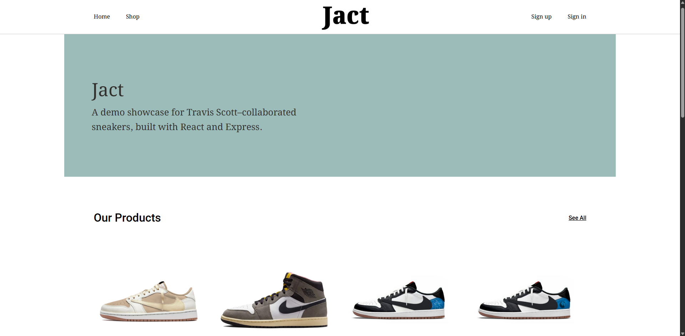
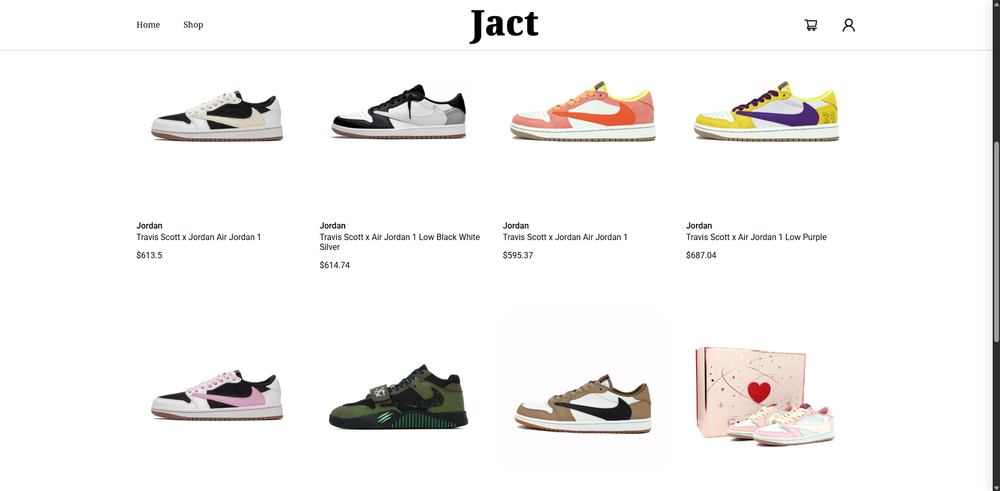
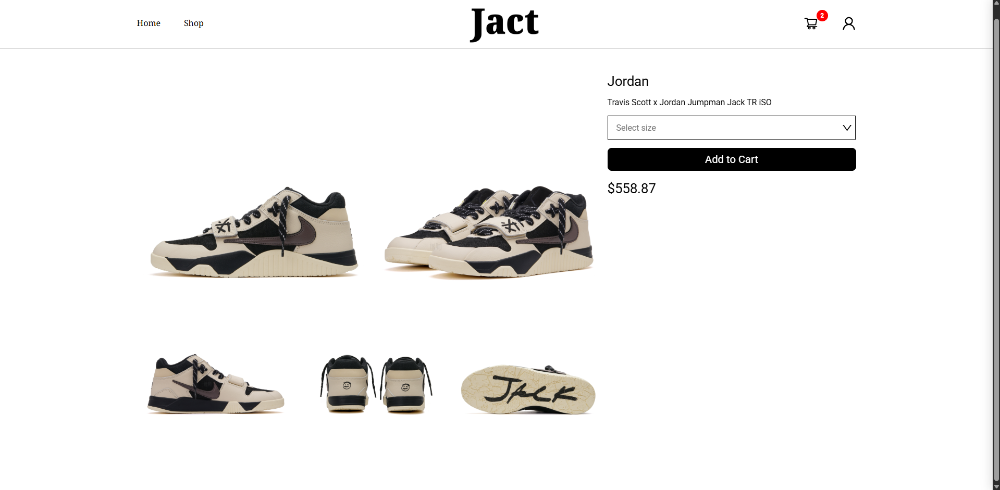
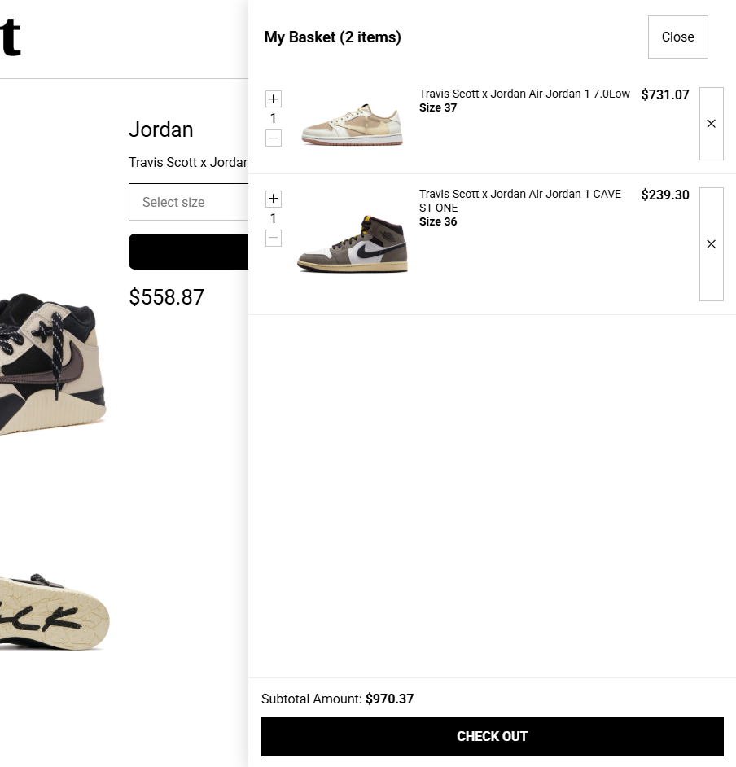

# jact
A CRUD for sneakers, check it out at [jact](https://jact-eta.vercel.app/)

# installation
### Clone repository, then cd into it
### Create .env with REACT_APP_API_URL as your backend url in /client
### Create .env based off .env.example in /server
### Build && run serverside
``` bash
cd server
npm install
node server
```
### then build && run clientside (open new terminal)
``` bash
cd client
npm install
npm run dev
```

# API 
| Method | Endpoint                      | Description             | Auth |
| ------ | ----------------------------- | ----------------------- | ---- |
| POST   | `/users/signup`               | Sign up a new user      | No   |
| POST   | `/users/signin`               | Login a user            | No   |
| GET    | `/users/verify?token=<token>` | Verify email            | No   |
| POST   | `/users/sendmail`             | Send verification email | Yes  |
| GET    | `/users/:id`                  | Get user info by ID     | Yes  |
| PUT    | `/users/`                     | Update profile          | Yes  |
| ------ | --------------- | ----------------- | --------------- |
| GET    | `/sneakers/`    | Get all sneakers  | No              |
| GET    | `/sneakers/:id` | Get sneaker by ID | No              |
| POST   | `/sneakers/`    | Add a new sneaker | Yes, Admin only |
| DELETE | `/sneakers/:id` | Delete a sneaker  | Yes, Admin only |
| ------ | ---------------------------------------------- | ---------------------------------- | ---- |
| GET    | `/baskets/:basketId`                           | Get sneakers in a basket           | Yes  |
| GET    | `/baskets/:basketId/contains/:sneakerId/:size` | Check if basket contains a sneaker | Yes   |
| POST   | `/baskets/:basketId/add`                       | Add sneaker to basket              | Yes, Admin only |
| DELETE | `/baskets/:basketId/remove/:sneakerId/:size`   | Remove sneaker from basket         | Yes, Admin only |
| PATCH  | `/baskets/:basketId/update/:sneakerId/:size`   | Update sneaker quantity            | Yes   |

# screenshots
### Main page

### Shop

### Sneaker details

### Basket

